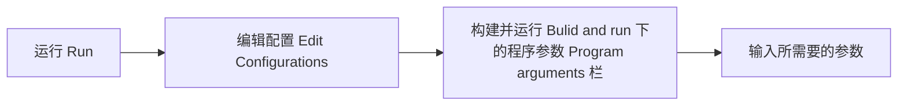

# 第三章 Java类基础知识

[TOC]

## 第一节 Java类结构和main函数

### Class 类

- 类是Java中最基础的逻辑单位

  ###### —Java中所有的内容都需要放在类中

- 类的构成

  > 变量
  >
  > 方法

- 类名和文件名保持一致

  ------

  

- **一个Java文件可以有多个class，但只能有一个public class**

  > public class必须与文件名保持完全一致

- 一个Java程序可以调用多个其他 Java class

### Main函数

- 一个Class最多只能有一个main函数

  *类可以没有main函数，不能主动执行，但可以被调用执行*

- main函数不算类的成员函数

- main函数是一个Java程序的总入口

- main函数无法被其他方法/类调用

  ------

  

- main函数写法

  ```java
  public static void main(String[] args){
      //单行注释
      /*多行
        块注释
      */
  }
  ```

  > String[] args  是main函数的形参，在启动时输入


## IDEA中配置args



------

## 第二节 基本类型和运算符

### 基本类型

| 类型           | 值的范围                | 默认值               | 占用字节数 |
| -------------- | ----------------------- | -------------------- | ---------- |
| boolean(布尔)  | true,false              | false                | 1          |
| byte(字节)     | -128—127                | 0                    | 1          |
| short(短整型)  | -32768—32767            | 0                    | 2          |
| int(整型)      | -2^31—2^31-1            | 0                    | 4          |
| long(长整型)   | -2^63—2^63-1            | 0L                   | 8          |
| float(单精度)  | ……                      | 0.0f                 | 4          |
| double(双精度) | ……                      | 0.0d                 | 8          |
| char(字符)     | 0(\u0000)—65535(\uffff) | '\u0000'(相当于空格) | 2          |

### 运算符

| 算术运算符    | 逻辑运算符 | 比较运算符      | 移位运算符 |
| ------------- | ---------- | --------------- | ---------- |
| +，-，*，/，% | &&,\|\|,!  | !=,>,>=,<,<=,== | >>,<<      |

## 第三节 选择和循环结构

### 选择结构

```java
//单分支选择
if(表达式){
    语句;
}
//多分支选择
if(表达式){
    语句1;
}
else
{
    语句2;
}
//
if(表达式1){
    语句1;
}
else if(表达式2){
    语句2;
}
else ……
//多重选择结构(switch)
switch(表达式){
    case 表达式1:语句1;break;
    case 表达式2:语句2;break;
    case 表达式3:语句3;break;
    ……
    default:语句n;
}
```

### 循环结构

```java
//while
while(表达式){
     语句;
}
//do while
do{
    语句;
}while(表达式);
//for
for(语句1;条件;语句2){
    语句;
    continue;//跳出本次循环，执行下次循环
    break;//结束整个循环，执行循环后的语句
}
```

## 自定义函数

- 函数必须放在类中

- 修饰词(方法)：public或者static，一般建议都用public

  返回值：int或void

  函数名(形参列表){函数体}

- 函数间可以相互调用

- 同一类中，函数名可以相同，即重载函数，但函数参数个数或类型必须不同

  ```java
  public class hello{
      public static void main(String[] args){
          int a=10,b=5,c;
          c=hello.func(a,b);
          System.Out.println("C is "+c);
      }
      public static int func(int a,char b){
           return a+b;
      }
  }
  ```

  

## 数据输入

### Scanner

1. 导包

   ```java
   import java.util.*;
   ```

2. 创建对象

   ```java
   Scanner s = new Scanner(System.in);//构造Scanner类对象，它附属于标准输入流System.in
   ```

3. 接收数据

   ```java
   int n=s.nextInt();
   /*常用的next()方法系列：  
   nextInt():输入整数              nextLine():输入字符串         nextDouble():输入双精度数     
   next():输入字符串（以空格作为分隔符）。  nextBoolean:输入逻辑值   nextByte:输入字符
   ……………………
   ```

   
