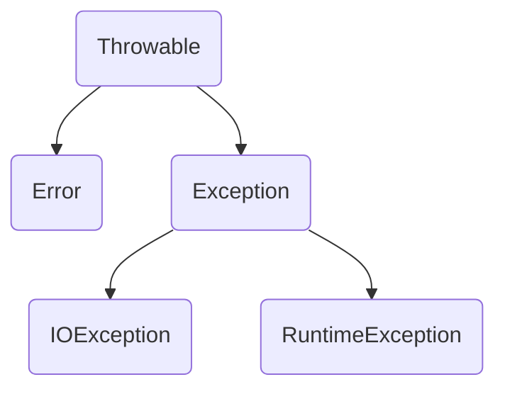

# 第九章笔记 Java异常和异常处理

[TOC]

## 第一节 Java异常分类

### 异常组织结构图


- Throwable：Java所有异常(错误)的祖先类
- Error：系统内部错误或者资源耗尽
- Exception：程序有关的异常
  - RuntimeException：程序自身的错误
  - 非RuntimeException：外界有关的错误

------

- Unchecked Exception：(编译器不会辅助检查)，包括Error子类和RuntimeException子类

  Error的子类，可以不用处理

  RuntimeException子类，程序必须处理，以预防为主。编译器不会辅助检查

- Checked Exception(非RuntimeException的Exception的子类)

  程序必须处理，以发生后处理为主，编译器会辅助检查

## 第二节 Java异常处理

### try-catch-finally

- 一种保护代码正常运行的机制

- 异常结构

  - try……catch(catch可以有多个)
  - try……catch……finally
  - try……finally

  **tips：try必须有，catch和finally至少要有一个**

#### try

—要实现的功能代码

#### catch

—当try发生异常，将执行catch代码

#### finally

—当try或catch执行结束后，必须要执行finally

------

- catch块可以有多个，每个有不同的入口形参。当已发生的异常和某一个catch块中的形参类型一致，那么将执行该catch块中的代码，如果没有匹配，catch不会被触发，最后都会进入finally块
- 进入catch块后，并不会返回到try发生异常的位置，也不会执行后续的catch块。一个异常只能进入一个catch块
- catch块的异常匹配时从上而下，一般小异常写在前，大异常一般写在后

------

- try结构中，如果有finally块，finally肯定会被执行
- try-catch-finally每个模块里也会发生异常，可以在内部再嵌套一个完整的try-catch-finally结构

------

- 方法存在可能异常的语句，但不处理，可以使用throws来声明异常
- 调用带有throws异常(checked exception)中的方法，要么处理异常，或再向外throws，直到main函数为止

------

- 一个方法被覆盖，覆盖它的方法必须抛出相同的异常或异常的子类
- 如果父类的方法抛出多个异常，那么重写的子类方法必须抛出那些异常的子类，不能抛出新的异常

## 第三节 自定义异常

- 自定义异常，需要继承Exception类或其子类
  - 继承自Exception，就变成Checked Exception
  - 继承自RuntimeException，就变成Unchecked Exception
- 自定义重点在构造函数
  - 调用父类Exception的message构造函数
  - 自定义自己的成员变量
- 在程序中用throw主动抛出异常

------

```java
public class MyException extends Exception {

   private String returnCode ;  //异常对应的返回码
   private String returnMsg;  //异常对应的描述信息
   
   public MyException() {
      super();
   }

   public MyException(String returnMsg) {
      super(returnMsg);
      this.returnMsg = returnMsg;
   }

   public MyException(String returnCode, String returnMsg) {
      super();
      this.returnCode = returnCode;
      this.returnMsg = returnMsg;
   }

   public String getReturnCode() {
      return returnCode;
   }

   public String getreturnMsg() {
      return returnMsg;
   }
}
```

```java
public class MyExceptionTest {
   public static void testException() throws MyException {  
       throw new MyException("10001", "The reason of myException");  
        //方法内部程序中，抛出异常 throw
        //方法头部声明中，抛出异常 throws
    }  
   
   public static void main(String[] args) {

      //MyExceptionTest.testException();
      
      try {
         MyExceptionTest.testException();
      } catch (MyException e) {
         e.printStackTrace();
         System.out.println("returnCode:"+e.getReturnCode());
         System.out.println("returnMsg:"+e.getreturnMsg());
      }
   }
}
```

