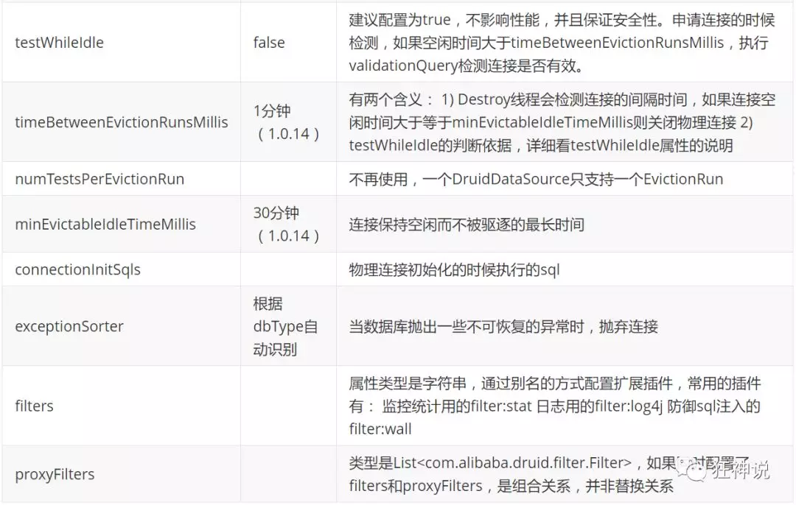
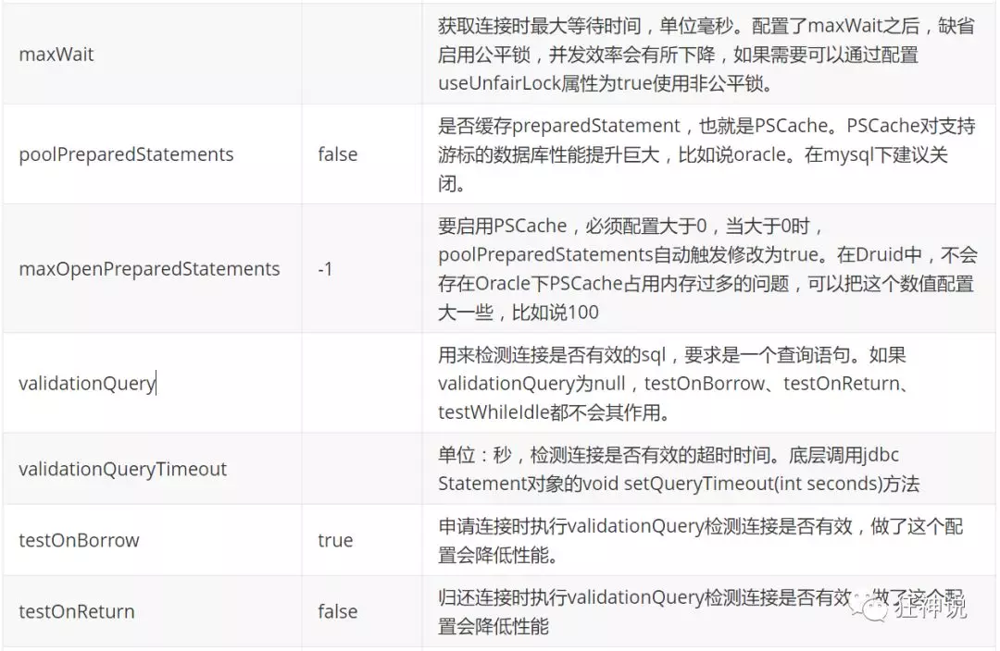

# SpringBoot

[TOC]

## 简介

Spring Boot 基于 Spring 开发，Spirng Boot 本身并不提供 Spring 框架的核心特性以及扩展功能，只是用于快速、敏捷地开发新一代基于 Spring 框架的应用程序。也就是说，它并不是用来替代 Spring 的解决方案，而是和 Spring 框架紧密结合用于提升 Spring 开发者体验的工具。Spring Boot 以**约定大于配置的核心思想**，默认帮我们进行了很多设置，多数 Spring Boot 应用只需要很少的 Spring 配置。同时它集成了大量常用的第三方库配置（例如 Redis、MongoDB、Jpa、RabbitMQ、Quartz 等等），Spring Boot 应用中这些第三方库几乎可以零配置的开箱即用。

简单来说就是SpringBoot其实不是什么新的框架，它默认配置了很多框架的使用方式，就像maven整合了所有的jar包，spring boot整合了所有的框架 。

Spring Boot 出生名门，从一开始就站在一个比较高的起点，又经过这几年的发展，生态足够完善，Spring Boot 已经当之无愧成为 Java 领域最热门的技术。

**Spring Boot的主要优点：**

- 为所有Spring开发者更快的入门
- **开箱即用**，提供各种默认配置来简化项目配置
- 内嵌式容器简化Web项目
- 没有冗余代码生成和XML配置的要求

------

## SpringBoot项目创建

**项目创建方式一：**使用Spring Initializr 的 Web页面创建项目

1、打开  https://start.spring.io/

2、填写项目信息

3、点击”Generate Project“按钮生成项目；下载此项目

4、解压项目包，并用IDEA以Maven项目导入，一路下一步即可，直到项目导入完毕。

5、如果是第一次使用，可能速度会比较慢，包比较多、需要耐心等待一切就绪。

------

**项目创建方式二：**使用 IDEA 直接创建项目

1、创建一个新项目

2、选择spring initalizr ， 可以看到默认就是去官网的快速构建工具那里实现

3、填写项目信息

4、选择初始化的组件（初学勾选 Web 即可）

5、填写项目路径

6、等待项目构建成功

------

## yaml文件

### yaml概述

YAML是 "YAML Ain't a Markup Language" （YAML不是一种标记语言）的递归缩写。在开发的这种语言时，YAML 的意思其实是："Yet Another Markup Language"（仍是一种标记语言）

**这种语言以数据作为中心，而不是以标记语言为重点！**

------

### yaml基础语法

说明：语法要求严格！

1、空格不能省略

2、以缩进来控制层级关系，只要是左边对齐的一列数据都是同一个层级的。

3、属性和值的大小写都是十分敏感的。


#### 字面量：普通的值  [ 数字，布尔值，字符串  ]

字面量直接写在后面就可以 ， 字符串默认不用加上双引号或者单引号；

```
k: v
```

注意：

- “ ” 双引号，不会转义字符串里面的特殊字符 ， 特殊字符会作为本身想表示的意思；

  比如 ：name: "kuang \n shen"  输出 ：kuang  换行  shen

- '' 单引号，会转义特殊字符 ， 特殊字符最终会变成和普通字符一样输出

  比如 ：name: ‘kuang \n shen’  输出 ：kuang  \n  shen

#### 对象、Map（键值对）

```yaml
#对象、Map格式
k:
     v1:    
     v2:
```

在下一行来写对象的属性和值的关系，注意缩进；比如：

```yaml
student:   
        name: JOJO
        age: 3
```

行内写法

```yaml
student: {name: JOJO,age: 3}
```

#### 数组（ List、set ）

用 - 值表示数组中的一个元素,比如：

```yaml
pets:
     - cat
     - dog
     - pig
```

行内写法

```yaml
pets: [cat,dog,pig]
```

**修改SpringBoot的默认端口号**

配置文件中添加，端口号的参数，就可以切换端口；

```yaml
server:  
       port: 8082
```

------

### yaml注入配置文件

1、在springboot项目中的resources目录下新建一个文件 application.yml

2、编写一个实体类 Dog；

```java
package com.test.config.pojo;

import org.springframework.boot.context.properties.ConfigurationProperties;
import org.springframework.stereotype.Component;
import org.springframework.validation.annotation.Validated;

import java.util.Date;
import java.util.List;
import java.util.Map;

@Component//注入bean到容器中
@ConfigurationProperties(prefix = "person")//参数绑定
@Validated //数据校验
public class Person {
    //@Email(message = "错误的邮箱")
    private String name;
    private int age;
    private boolean happy;
    private Date birth;
    private Map<String,Object> maps;
    private List<Object> lists;
    private Dog dog;

    public Person(){
    }

    public Person(String name,int age,boolean happy,Date birth,Map<String,Object> maps,List<Object> lists,Dog dog) {
        this.name = name;
        this.age=age;
        this.birth=birth;
        this.happy=happy;
        this.maps=maps;
        this.lists=lists;
        this.dog=dog;
    }

    public String getName() {
        return name;
    }

    public void setName(String name) {
        this.name = name;
    }

    public int getAge() {
        return age;
    }

    public void setAge(int age) {
        this.age = age;
    }

    public boolean isHappy() {
        return happy;
    }

    public void setHappy(boolean happy) {
        this.happy = happy;
    }

    public Date getBirth() {
        return birth;
    }

    public void setBirth(Date birth) {
        this.birth = birth;
    }

    public Map<String, Object> getMaps() {
        return maps;
    }

    public void setMaps(Map<String, Object> maps) {
        this.maps = maps;
    }

    public List<Object> getLists() {
        return lists;
    }

    public void setLists(List<Object> lists) {
        this.lists = lists;
    }

    public Dog getDog() {
        return dog;
    }

    public void setDog(Dog dog) {
        this.dog = dog;
    }

    @Override
    public String toString() {
        return "Person{" +
                "name='" + name + '\'' +
                ", age=" + age +
                ", happy=" + happy +
                ", birth=" + birth +
                ", maps=" + maps +
                ", lists=" + lists +
                ", dog=" + dog +
                '}';
    }
}
```

@ConfigurationProperties作用：将配置文件中配置的每一个属性的值，映射到这个组件中；告诉SpringBoot将本类中的所有属性和配置文件中相关的配置进行绑定参数 prefix = “person” : 将配置文件中的person下面的所有属性一一对应

**导入依赖**

```xml
<dependency>
    <groupId>org.springframework.boot</groupId>
    <artifactId>spring-boot-configuration-processor</artifactId>
    <optional>true</optional>
</dependency>
```

#### 配置文件占位符

配置文件还可以编写占位符生成随机数

```yaml
person:    
        name: qinjiang${random.uuid} # 随机uuid    
         age: ${random.int}  # 随机int  
       happy: false  
       birth: 2000/01/01 
        maps: {k1: v1,k2: v2}     
       lists:     
             - code  
             - girl
             - music  
         dog: 
           name: ${person.hello:other}_旺财  
           age: 1
```

#### 加载指定的配置文件

**@PropertySource ：**加载指定的配置文件

**@configurationProperties**：默认从全局配置文件中获取值

## JSR303数据校验

Springboot中可以用注解**@validated**来校验数据，如果数据异常则会统一抛出异常，方便异常中心统一处理。

### 常见参数

```java
@NotNull(message="名字不能为空")
private String userName;
@Max(value=120,message="年龄最大不能查过120")
private int age;
@Email(message="邮箱格式错误")
private String email;

空检查
@Null       验证对象是否为null
@NotNull    验证对象是否不为null, 无法查检长度为0的字符串
@NotBlank   检查约束字符串是不是Null还有被Trim的长度是否大于0,只对字符串,且会去掉前后空格.
@NotEmpty   检查约束元素是否为NULL或者是EMPTY.    
    
Booelan检查
@AssertTrue     验证 Boolean 对象是否为 true  
@AssertFalse    验证 Boolean 对象是否为 false     

长度检查
@Size(min=, max=) 验证对象（Array,Collection,Map,String）长度是否在给定的范围之内 @Length(min=, max=) string is between min and max included.
    
日期检查
@Past       验证 Date 和 Calendar 对象是否在当前时间之前
@Future     验证 Date 和 Calendar 对象是否在当前时间之后
@Pattern    验证 String 对象是否符合正则表达式的规则
.......等等除此以外，我们还可以自定义一些数据校验规则
```

## 多环境配置

我们在主配置文件编写的时候，文件名可以是 application-{profile}.properties/yml , 用来指定多个环境版本；

**例如：**

application-test.properties 代表测试环境配置

application-dev.properties 代表开发环境配置

但是Springboot并不会直接启动这些配置文件，它**默认使用application.properties主配置文件**；

我们需要通过一个配置来选择需要激活的环境：

```properties
#比如在配置文件中指定使用dev环境，我们可以通过设置不同的端口号进行测试；
#我们启动SpringBoot，就可以看到已经切换到dev下的配置了；
spring.profiles.active=dev
```

### yaml的多文档块

```yaml
server:  
       port: 8081
#选择要激活那个环境块
spring: 
   profiles:   
     active: prod
---

server: 
       port: 8083
spring:  
   profiles: dev #配置环境的名称

---

server: 
       port: 8084
spring:
   profiles: prod  #配置环境的名称
```

**注意：如果yml和properties同时都配置了端口，并且没有激活其他环境 ， 默认会使用properties配置文件的！**

### 配置文件加载位置

**外部加载配置文件的方式十分多，我们选择最常用的即可，在开发的资源文件中进行配置！**

springboot 启动会扫描以下位置的application.properties或者application.yml文件作为Spring boot的默认配置文件：

```java
优先级1：项目路径下的config文件夹配置文件  file:./config/
优先级2：项目路径下配置文件   file:/
优先级3：资源路径下的config文件夹配置文件  classpath:./config/
优先级4：资源路径下配置文件   classpath:/
```

**SpringBoot会从这四个位置全部加载主配置文件；互补配置；**

我们在最低级的配置文件中设置一个项目访问路径的配置来测试互补问题；

```properties
#配置项目的访问路径
server.servlet.context-path=/test
```

------

## 静态资源映射规则

那我们项目中要是使用自己的静态资源该怎么导入呢？我们看下一行代码；

我们去找staticPathPattern发现第二种映射规则 ：/** , 访问当前的项目任意资源，它会去找 resourceProperties 这个类，我们可以点进去看一下分析：

```java
// 进入方法
public String[] getStaticLocations() { return this.staticLocations;}
// 找到对应的值
private String[] staticLocations = CLASSPATH_RESOURCE_LOCATIONS;
// 找到路径
private static final String[] CLASSPATH_RESOURCE_LOCATIONS = {     "classpath:/META-INF/resources/",                                               "classpath:/resources/",                                                         "classpath:/static/",
"classpath:/public/" };
```

ResourceProperties 可以设置和我们静态资源有关的参数；这里面指向了它会去寻找资源的文件夹，即上面数组的内容。

所以得出结论，以下四个目录存放的静态资源可以被我们识别：

```java
"classpath:/METAINF/resources/"
"classpath:/resources/"
"classpath:/static/"
"classpath:/public/"
//优先级 resours>static>public
```

我们可以在resources根目录下新建对应的文件夹，都可以存放我们的静态文件；

### 自定义静态资源路径

我们也可以自己通过配置文件来指定一下，哪些文件夹是需要我们放静态资源文件的，在application.properties中配置；

```properties
spring.resources.static-locations=classpath:/coding/,classpath:/test/
```

一旦自己定义了静态文件夹的路径，原来的自动配置就都会失效了！

------

## Thymeleaf


```xml
<dependency>
    <groupId>org.springframework.boot</groupId>
    <artifactId>spring-boot-starter-thymeleaf</artifactId>
    <version>2.5.3</version>
</dependency>
```

------

### Thymeleaf分析

前面呢，我们已经引入了Thymeleaf，那这个要怎么使用呢？

我们首先得按照SpringBoot的自动配置原理看一下我们这个Thymeleaf的自动配置规则，在按照那个规则，我们进行使用。

我们去找一下Thymeleaf的自动配置类：ThymeleafProperties

```java
@ConfigurationProperties(  
        prefix = "spring.thymeleaf"
)
public class ThymeleafProperties {   
        private static final Charset DEFAULT_ENCODING;
        public static final String DEFAULT_PREFIX = "classpath:/templates/";  
        public static final String DEFAULT_SUFFIX = ".html"; 
        private boolean checkTemplate = true;   
        private boolean checkTemplateLocation = true;  
        private String prefix = "classpath:/templates/";  
        private String suffix = ".html";  
        private String mode = "HTML";  
        private Charset encoding;}
```

我们可以在其中看到默认的前缀和后缀！

我们只需要把我们的html页面放在类路径下的templates下，thymeleaf就可以帮我们自动渲染了。

使用thymeleaf什么都不需要配置，只需要将他放在指定的文件夹下即可！

```java
Selection Variable Expressions: *{...}：选择表达式：和${}在功能上是一样； 
Message Expressions: #{...}：获取国际化内容 
Link URL Expressions: @{...}：定义URL；  
Fragment Expressions: ~{...}：片段引用表达式

Literals（字面量）    
Text literals: 'one text' , 'Another one!' ,…   
Number literals: 0 , 34 , 3.0 , 12.3 ,…    
Boolean literals: true , false    
Null literal: null    
Literal tokens: one , sometext , main ,…    

Text operations:（文本操作）   
String concatenation: +    
Literal substitutions: |The name is ${name}| 

Arithmetic operations:（数学运算）   
Binary operators: + , - , * , / , %   
Minus sign (unary operator): -   
Boolean operations:（布尔运算） 
Binary operators: and , or  
Boolean negation (unary operator): ! , not    

Comparisons and equality:（比较运算）  
Comparators: > , < , >= , <= ( gt , lt , ge , le )    
Equality operators: == , != ( eq , ne )   
Conditional operators:条件运算（三元运算符）  
If-then: (if) ? (then)    
If-then-else: (if) ? (then) : (else)  
Default: (value) ?: (defaultvalue)   

Special tokens:   
No-Operation: _
```

------

## 扩展使用SpringMVC

```java
//应为类型要求为WebMvcConfigurer，所以我们实现其接口//可以使用自定义类扩展MVC的功能@Configuration
public class MyMvcConfig implements WebMvcConfigurer {
    @Override   
    public void addViewControllers(ViewControllerRegistry registry) {        
        // 浏览器发送/test ， 就会跳转到test页面； 
   registry.addViewController("/test").setViewName("test");   
    }
}
```

**既保留SpringBoot所有的自动配置，也能用我们扩展的配置！**

Tips：若加上注解@EnableWebMvc表示全面接管SpringMVC，会将WebMvcConfigurationSupport组件（SpringMVC最基本的功能）导入，从而导致自动配置失效

------

## 页面国际化

1. 在Resource目录下添加配置文件

   login.properties ：默认

   ```properties
   login.button=登录
   login.Password=密码
   login.remember=记住我
   login.tip=请登录
   login.Username=用户名
   ```

   login_en_US.properties ：英文

   ```properties
   login.button=Sign in
   login.Password=Password
   login.remember=Remember me
   login.tip=Please sign in
   login.Username=Username
   ```

   login_zh_CN.properties ：中文

   ```properties
   login.button=登录
   login.Password=密码
   login.remember=记住我
   login.tip=请登录
   login.Username=用户名
   ```

2. 修改前端使用国际化代码th：……="#{login.……}"

   ```html
   <h1 class="h3 mb-3 font-weight-normal" th:text="#{login.tip}"/>
   
   <input type="text" name="username" class="form-control" 
          th:placeholder="#{login.Username}" required="" autofocus="">
   
   <input type="password" name="password" class="form-control" 
          th:placeholder="#{login.Password}" required="">
   
   <input type="checkbox" value="remember-me" th:text="#{login.remember}">
   
   <button class="btn btn-lg btn-primary btn-block" type="submit"
           th:text="#{login.button}"/>
   ```

3. 修改前端跳转链接

   ```html
   <a class="btn btn-sm" th:href="@{/index.html(language='zh_CN')}">中文</a>
   <a class="btn btn-sm" th:href="@{/index.html(language='en_US')}">English</a>
   ```

4. 编写处理的组件类

   ```java
   package com.test.config;
   
   import org.springframework.context.annotation.Configuration;
   import org.springframework.web.servlet.LocaleResolver;
   import org.thymeleaf.util.StringUtils;
   
   import javax.servlet.http.HttpServletRequest;
   import javax.servlet.http.HttpServletResponse;
   import java.util.Locale;
   
   @Configuration
   public class MyLocaleResolver implements LocaleResolver {
   
       //解析请求
       @Override
       public Locale resolveLocale(HttpServletRequest httpServletRequest) {
   
           //获取请求中的语言参数链接
           String language=httpServletRequest.getParameter("language");
   
           Locale locale=Locale.getDefault();
   
           //如果请求连接不为空
           if(!StringUtils.isEmpty(language)){
               //zh_CN
               String split[]=language.split("_");
   
               //语言，国家
               locale=new Locale(split[0],split[1]);
           }
           return locale;
       }
   
       @Override
       public void setLocale(HttpServletRequest httpServletRequest, HttpServletResponse httpServletResponse, Locale locale) {
   
       }
   }
   ```

5. 在自定义MVC配置类中添加Bean

   ```java
   //自定义的国际化组件放到bean中就生效了
   @Bean
   public LocaleResolver localeResolver(){
       return new MyLocaleResolver();
   }
   ```

------

## 整合JDBC

### 创建测试项目测试数据源

1、新建一个项目引入相应模块：**Spring Web，JDBC API，MySQL Driver**

2、项目建好之后，发现自动帮我们导入了如下的启动器：

```xml
<dependency> 
    <groupId>org.springframework.boot</groupId> 
    <artifactId>spring-boot-starter-jdbc</artifactId>
</dependency>
<dependency>   
    <groupId>mysql</groupId>  
    <artifactId>mysql-connector-java</artifactId>
    <scope>runtime</scope>
</dependency>
```

3、编写yaml配置文件连接数据库：

```yaml
spring:
  datasource:
    username: root
    password: 2020215059
    url: jdbc:mysql://localhost:3306/mybatis
    driver-class-name: com.mysql.cj.jdbc.Driver
```

 4、配置完这一些东西后，我们就可以直接去使用了，因为SpringBoot已经默认帮我们进行了自动配置；去测试类测试一下

```java
@SpringBootTest
class SpringbootDataJdbcApplicationTests {
    
    //DI注入数据源   
    @Autowired   
    DataSource dataSource;
    
    @Test   
    public void contextLoads() throws SQLException {
    
    //看一下默认数据源      
    System.out.println(dataSource.getClass());  
    
    //获得连接        
    Connection connection =   dataSource.getConnection();
    System.out.println(connection);     
    
    //关闭连接       
    connection.close(); 
    }
}
```

------

**HikariDataSource 号称 Java WEB 当前速度最快的数据源，相比于传统的 C3P0 、DBCP、Tomcat jdbc 等连接池更加优秀；**

**可以使用 spring.datasource.type 指定自定义的数据源类型，值为 要使用的连接池实现的完全限定名。**

------

### JDBCTemplate

1、有了数据源(com.zaxxer.hikari.HikariDataSource)，然后可以拿到数据库连接(java.sql.Connection)，有了连接，就可以使用原生的 JDBC 语句来操作数据库；

2、即使不使用第三方第数据库操作框架，如 MyBatis等，Spring 本身也对原生的JDBC 做了轻量级的封装，即JdbcTemplate。

3、数据库操作的所有 CRUD 方法都在 JdbcTemplate 中。

4、Spring Boot 不仅提供了默认的数据源，同时默认已经配置好了 JdbcTemplate 放在了容器中，程序员只需自己注入即可使用

5、JdbcTemplate 的自动配置是依赖 org.springframework.boot.autoconfigure.jdbc 包下的 JdbcTemplateConfiguration 类

**JdbcTemplate主要提供以下几类方法：**

- execute方法：可以用于执行任何SQL语句，一般用于执行DDL语句；
- update方法及batchUpdate方法：update方法用于执行新增、修改、删除等语句；batchUpdate方法用于执行批处理相关语句；
- query方法及queryForXXX方法：用于执行查询相关语句；
- call方法：用于执行存储过程、函数相关语句。

------

#### 测试

编写一个Controller，注入 jdbcTemplate，编写测试方法进行访问测试；

```java
package com.test.controller;
import org.springframework.beans.factory.annotation.Autowired;
import org.springframework.jdbc.core.JdbcTemplate;
import org.springframework.web.bind.annotation.GetMapping;
import org.springframework.web.bind.annotation.PathVariable;
import org.springframework.web.bind.annotation.RequestMapping;
import org.springframework.web.bind.annotation.RestController;
import java.util.Date;import java.util.List;import java.util.Map;
@RestController
@RequestMapping("/jdbc")public class JdbcController {
    /**    
    * Spring Boot 默认提供了数据源，默认提供了  
    * org.springframework.jdbc.core.JdbcTemplate    
    * JdbcTemplate 中会自己注入数据源，用于简化 JDBC操作 
    * 还能避免一些常见的错误,使用起来也不用再自己来关闭数据库连接 
    **/ 
    
    @Autowired    
    JdbcTemplate jdbcTemplate;
    //查询employee表中所有数据  
    //List 中的1个 Map 对应数据库的 1行数据 
    //Map 中的 key 对应数据库的字段名，value 对应数据库的字段值  
    @GetMapping("/list")    
    public List<Map<String, Object>> userList(){      
        String sql = "select * from employee";       
        List<Map<String, Object>> maps = jdbcTemplate.queryForList(sql);        
        return maps;   
    }        
    //新增一个用户    
    @GetMapping("/add")    
    public String addUser(){       
        //插入语句，注意时间问题       
        String sql = 
            "insert into employee(last_name,email,gender,department,birth)" + 
            " values ('狂神说','24736743@qq.com',1,101,'"+ new 
            Date().toLocaleString() +"')";    
            jdbcTemplate.update(sql);      
        //查询        
        return "addOk";    }
    
    //修改用户信息   
    @GetMapping("/update/{id}")    
    public String updateUser(@PathVariable("id") int id){       
        //插入语句       
        String sql = "update employee set last_name=?,email=? where id="+id;     
        //数据        
        Object[] objects = new Object[2];   
        objects[0] = "JOJO";      
        objects[1] = "***.com";      
        jdbcTemplate.update(sql,objects);      
        //查询        
        return "updateOk";    }
   
    //删除用户  
    @GetMapping("/delete/{id}")    
    public String delUser(@PathVariable("id") int id){  
        //插入语句        
        String sql = "delete from employee where id=?";        
        jdbcTemplate.update(sql,id);     
        //查询       
        return "deleteOk";   
    }   
}
```

------

## 整合Druid

### Druid简介

Java程序很大一部分要操作数据库，为了提高性能操作数据库的时候，又不得不使用数据库连接池。

Druid 是阿里巴巴开源平台上一个数据库连接池实现，结合了 C3P0、DBCP 等 DB 池的优点，同时加入了日志监控。

Druid 可以很好的监控 DB 池连接和 SQL 的执行情况，天生就是针对监控而生的 DB 连接池。

Druid已经在阿里巴巴部署了超过600个应用，经过一年多生产环境大规模部署的严苛考验。

Spring Boot 2.0 以上默认使用 Hikari 数据源，可以说 Hikari 与 Driud 都是当前 Java Web 上最优秀的数据源，我们来重点介绍 Spring Boot 如何集成 Druid 数据源，如何实现数据库监控。

Github地址：https://github.com/alibaba/druid/

------

**com.alibaba.druid.pool.DruidDataSource 基本配置参数如下：**






## 配置数据源

1、添加上 Druid 数据源依赖：

```xml
<dependency>
    <groupId>com.alibaba</groupId>
    <artifactId>druid</artifactId>
    <version>1.2.6</version>
</dependency>
```

2、切换数据源：

```yaml
spring:
  datasource:
    username: root
    password: 2020215059
    url: jdbc:mysql://localhost:3306/mybatis
    driver-class-name: com.mysql.cj.jdbc.Driver
    type: com.alibaba.druid.pool.DruidDataSource
    
    #Spring Boot 默认是不注入这些属性值的，需要自己绑定
    #druid 数据源专有配置
    initialSize: 5
    minIdle: 5
    maxActive: 20
    maxWait: 60000
    timeBetweenEvictionRunsMillis: 60000
    minEvictableIdleTimeMillis: 300000
    validationQuery: SELECT 1 FROM DUAL
    testWhileIdle: true
    testOnBorrow: false
    testOnReturn: false
    poolPreparedStatements: true

    #配置监控统计拦截的filters，stat:监控统计、log4j：日志记录、wall：防御sql注入
    #如果允许时报错  java.lang.ClassNotFoundException: org.apache.log4j.Priority
    #则导入 log4j 依赖即可，Maven 地址：https://mvnrepository.com/artifact/log4j/log4j
    filters: stat,wall,log4j
    maxPoolPreparedStatementPerConnectionSize: 20
    useGlobalDataSourceStat: true
    connectionProperties: druid.stat.mergeSql=true;druid.stat.slowSqlMillis=500
```

3、导入Log4j 的依赖

```xml
<dependency>
    <groupId>log4j</groupId>
    <artifactId>log4j</artifactId>
    <version>1.2.17</version>
</dependency>
```

4、现在需要程序员自己为 DruidDataSource 绑定全局配置文件中的参数，再添加到容器中，而不再使用 Spring Boot 的自动生成了；我们需要 自己添加 DruidDataSource 组件到容器中，并绑定属性；

```java
package com.test.config;

import com.alibaba.druid.pool.DruidDataSource;
import org.springframework.boot.context.properties.ConfigurationProperties;
import org.springframework.context.annotation.Bean;
import org.springframework.context.annotation.Configuration;

import javax.sql.DataSource;

@Configuration
public class DruidConfig {

    /*
       将自定义的 Druid数据源添加到容器中，不再让 Spring Boot 自动创建
       绑定全局配置文件中的 druid 数据源属性到 com.alibaba.druid.pool.DruidDataSource从而让它们生效
       @ConfigurationProperties(prefix = "spring.datasource")：作用就是将 全局配置文件中
       前缀为 spring.datasource的属性值注入到 com.alibaba.druid.pool.DruidDataSource 的同名参数中
     */
    @ConfigurationProperties(prefix = "spring.datasource")
    @Bean
    public DataSource druidDataSource() {
        return new DruidDataSource();
    }

}
```

7、测试

```java
@SpringBootTest
class SpringbootDataJdbcApplicationTests {

    //DI注入数据源
    @Autowired
    DataSource dataSource;

    @Test
    public void contextLoads() throws SQLException {
        //看一下默认数据源
        System.out.println(dataSource.getClass());
        //获得连接
        Connection connection =   dataSource.getConnection();
        System.out.println(connection);

        DruidDataSource druidDataSource = (DruidDataSource) dataSource;
        System.out.println("druidDataSource 数据源最大连接数：" + druidDataSource.getMaxActive());
        System.out.println("druidDataSource 数据源初始化连接数：" + druidDataSource.getInitialSize());

        //关闭连接
        connection.close();
    }
}
```

------

### 配置Druid数据源监控

Druid 数据源具有监控的功能，并提供了一个 web 界面方便用户查看，类似安装 路由器 时，人家也提供了一个默认的 web 页面。

所以第一步需要设置 Druid 的后台管理页面，比如 登录账号、密码 等；配置后台管理；

```java
package com.test.data.config;

import com.alibaba.druid.pool.DruidDataSource;
import com.alibaba.druid.support.http.StatViewServlet;
import com.alibaba.druid.support.http.WebStatFilter;
import org.springframework.boot.context.properties.ConfigurationProperties;
import org.springframework.boot.web.servlet.FilterRegistrationBean;
import org.springframework.boot.web.servlet.ServletRegistrationBean;
import org.springframework.context.annotation.Bean;
import org.springframework.context.annotation.Configuration;

import javax.sql.DataSource;
import java.util.HashMap;
import java.util.Map;

@Configuration
public class DruidConfig {


    @ConfigurationProperties(prefix = "spring.datasource")
    @Bean
    public DataSource DruidDataSource(){
        return  new DruidDataSource();
    }

    //后台监控:web.xml
    @Bean
    public ServletRegistrationBean statViewServlet(){
        ServletRegistrationBean<StatViewServlet> bean=new ServletRegistrationBean<>(new StatViewServlet(),"/druid/*");
        //后台需要登录，账号密码设置
        HashMap<String,String> initParameters=new HashMap<>();

        //增加配置
        initParameters.put("loginUsername","JOJO"); //登录的key是固定的 loginUsername loginPassword
        initParameters.put("loginPassword","123456");

        //允许谁访问
        initParameters.put("allow","");

        //禁止谁访问
       // initParameters.put("133","192.168.11.123");  用户名 ip

        bean.setInitParameters(initParameters);//设置初始化参数
        return bean;
    }

    //过滤器
    public FilterRegistrationBean webStatFilter(){
        FilterRegistrationBean bean=new FilterRegistrationBean<>();
        bean.setFilter(new WebStatFilter());

        //过滤那些请求
        Map<String,String> initParameters=new HashMap<>();
        //不进行统计
        initParameters.put("exclusions","*.js,*.css,/druid/*");
        return bean;
    }
}
```

------

## 整合Mybatis

1、导入 MyBatis 所需要的依赖

```xml
<dependency>
    <groupId>org.springframework.boot</groupId>
    <artifactId>spring-boot-starter-test</artifactId>
    <scope>test</scope>
</dependency>
```

2、配置数据库连接信息

```yaml
spring:
  datasource:
    username: root
    password: 2020215059
    url: jdbc:mysql://localhost:3306/mybatis
    driver-class-name: com.mysql.cj.jdbc.Driver
    type: com.alibaba.druid.pool.DruidDataSource

    initialSize: 5
    minIdle: 5
    maxActive: 20
    maxWait: 60000
    timeBetweenEvictionRunsMillis: 60000
    minEvictableIdleTimeMillis: 300000
    validationQuery: SELECT 1 FROM DUAL
    testWhileIdle: true
    testOnBorrow: false
    testOnReturn: false
    poolPreparedStatements: true

    filters: stat,wall,log4j
    maxPoolPreparedStatementPerConnectionSize: 20
    useGlobalDataSourceStat: true
    connectionProperties: druid.stat.mergeSql=true;druid.stat.slowSqlMillis=500
```

3、创建实体类，导入 Lombok！

Department.java

```java
package com.test.pojo;

import lombok.AllArgsConstructor;
import lombok.Data;
import lombok.NoArgsConstructor;

@Data
@NoArgsConstructor
@AllArgsConstructor
public class Department {

    private Integer id;
    private String departmentName;

}
```

 Employee.java

```java
package com.test.pojo;

import lombok.AllArgsConstructor;
import lombok.Data;
import lombok.NoArgsConstructor;

@Data
@AllArgsConstructor
@NoArgsConstructor
public class Employee {

    private Integer id;
    private String lastName;
    private String email;
    //1 male, 0 female
    private Integer gender;
    private Integer department;
    private Date birth;

    private Department eDepartment; // 冗余设计

}
```

------

4、创建mapper目录以及对应的 Mapper 接口

DepartmentMapper.java

```java
//@Mapper : 表示本类是一个 MyBatis 的 Mapper
@Mapper
@Repository
public interface DepartmentMapper {

    // 获取所有部门信息
    List<Department> getDepartments();

    // 通过id获得部门
    Department getDepartment(Integer id);

}
```

EmployeeMapper.java

```java

//@Mapper : 表示本类是一个 MyBatis 的 Mapper
@Mapper
@Repository
public interface EmployeeMapper {

    // 获取所有员工信息
    List<Employee> getEmployees();

    // 新增一个员工
    int save(Employee employee);

    // 通过id获得员工信息
    Employee get(Integer id);

    // 通过id删除员工
    int delete(Integer id);

}
```

------

5、对应的Mapper映射文件

DepartmentMapper.xml

```xml
<?xml version="1.0" encoding="UTF-8" ?>
<!DOCTYPE mapper
        PUBLIC "-//mybatis.org//DTD Mapper 3.0//EN"
        "http://mybatis.org/dtd/mybatis-3-mapper.dtd">

<mapper namespace="com.test.mapper.DepartmentMapper">

    <select id="getDepartments" resultType="Department">
       select * from department;
    </select>

    <select id="getDepartment" resultType="Department" parameterType="int">
       select * from department where id = #{id};
    </select>

</mapper>
```

EmployeeMapper.xml

```xml

<?xml version="1.0" encoding="UTF-8" ?>
<!DOCTYPE mapper
        PUBLIC "-//mybatis.org//DTD Mapper 3.0//EN"
        "http://mybatis.org/dtd/mybatis-3-mapper.dtd">

<mapper namespace="com.test.mapper.EmployeeMapper">

    <resultMap id="EmployeeMap" type="Employee">
        <id property="id" column="eid"/>
        <result property="lastName" column="last_name"/>
        <result property="email" column="email"/>
        <result property="gender" column="gender"/>
        <result property="birth" column="birth"/>
        <association property="eDepartment"  javaType="Department">
            <id property="id" column="did"/>
            <result property="departmentName" column="dname"/>
        </association>
    </resultMap>

    <select id="getEmployees" resultMap="EmployeeMap">
        select e.id as eid,last_name,email,gender,birth,d.id as did,d.department_name as dname
        from department d,employee e
        where d.id = e.department
    </select>

    <insert id="save" parameterType="Employee">
        insert into employee (last_name,email,gender,department,birth)
        values (#{lastName},#{email},#{gender},#{department},#{birth});
    </insert>

    <select id="get" resultType="Employee">
        select * from employee where id = #{id}
    </select>

    <delete id="delete" parameterType="int">
        delete from employee where id = #{id}
    </delete>

</mapper>
```

------

6、Contoller

DepartmentController.java

```java

@RestController
public class DepartmentController {
    
    @Autowired
    DepartmentMapper departmentMapper;
    
    // 查询全部部门
    @GetMapping("/getDepartments")
    public List<Department> getDepartments(){
        return departmentMapper.getDepartments();
    }

    // 查询全部部门
    @GetMapping("/getDepartment/{id}")
    public Department getDepartment(@PathVariable("id") Integer id){
        return departmentMapper.getDepartment(id);
    }
    
}
```

EmployeeController.java

```java

@RestController
public class EmployeeController {

    @Autowired
    EmployeeMapper employeeMapper;

    // 获取所有员工信息
    @GetMapping("/getEmployees")
    public List<Employee> getEmployees(){
        return employeeMapper.getEmployees();
    }

    @GetMapping("/save")
    public int save(){
        Employee employee = new Employee();
        employee.setLastName("kuangshen");
        employee.setEmail("qinjiang@qq.com");
        employee.setGender(1);
        employee.setDepartment(101);
        employee.setBirth(new Date());
        return employeeMapper.save(employee);
    }

    // 通过id获得员工信息
    @GetMapping("/get/{id}")
    public Employee get(@PathVariable("id") Integer id){
        return employeeMapper.get(id);
    }

    // 通过id删除员工
    @GetMapping("/delete/{id}")
    public int delete(@PathVariable("id") Integer id){
        return employeeMapper.delete(id);
    }

}
```

