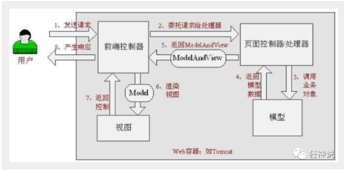
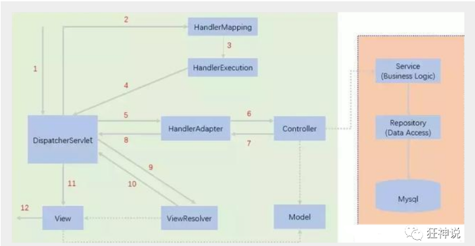

# SpringMVC

[TOC]

## MVC

- MVC是模型(Model)、视图(View)、控制器(Controller)的简写，是一种软件设计规范。
- 是将业务逻辑、数据、显示分离的方法来组织代码。
- MVC主要作用是**降低了视图与业务逻辑间的双向偶合**。
- MVC不是一种设计模式，**MVC是一种架构模式**。当然不同的MVC存在差异。

**Model（模型）：**数据模型，提供要展示的数据，因此包含数据和行为，可以认为是领域模型或JavaBean组件（包含数据和行为），不过现在一般都分离开来：Value Object（数据Dao） 和 服务层（行为Service）。也就是模型提供了模型数据查询和模型数据的状态更新等功能，包括数据和业务。

**View（视图）：**负责进行模型的展示，一般就是我们见到的用户界面，客户想看到的东西。

**Controller（控制器）：**接收用户请求，委托给模型进行处理（状态改变），处理完毕后把返回的模型数据返回给视图，由视图负责展示。 也就是说控制器做了个调度员的工作。

**Controller：控制器**

1. 取得表单数据
2. 调用业务逻辑
3. 转向指定的页面

**Model：模型**

1. 业务逻辑
2. 保存数据的状态

**View：视图**

1. 显示页面

**MVC框架要做哪些事情**

1. 将url映射到java类或java类的方法 
2. 封装用户提交的数据 
3. 处理请求--调用相关的业务处理--封装响应数据 
4. 将响应的数据进行渲染 . jsp / html 等表示层数据 

------

## SpringMVC

### Spring MVC的特点

1. 高效 , 基于请求响应的MVC框架
2. 与Spring兼容性好，无缝结合
3. 约定优于配置
4. 功能强大：RESTful、数据验证、格式化、本地化、主题等

Spring的web框架围绕**DispatcherServlet** [ 调度Servlet ] 设计。DispatcherServlet的作用是将请求分发到不同的处理器

### SpringMVC的原理

当发起请求时被前置的控制器拦截到请求，根据请求参数生成代理请求，找到请求对应的实际控制器，控制器处理请求，创建数据模型，访问数据库，将模型响应给中心控制器，控制器使用模型与视图渲染视图结果，将结果返回给中心控制器，再将结果返回给请求者。





####       适配请求内容

1. DispatcherServlet表示前置控制器，是整个SpringMVC的控制中心。用户发出请求，DispatcherServlet接收请求并拦截请求。

   - 我们假设请求的url为 : [http://localhost](http://localhost/):8080/SpringMVC/hello
   - **如上url拆分成三部分：**
   - [http://localhost](http://localhost/): 8080   服务器域名
   - SpringMVC    部署在服务器上的web站点
   - hello   表示控制器
   - 通过分析，如上url表示为：请求位于服务器localhost:8080上的SpringMVC站点的hello控制器。

2. HandlerMapping为处理器映射。DispatcherServlet调用HandlerMapping,HandlerMapping根据请求url查找Handler。

3. HandlerExecution表示具体的Handler,其主要作用是根据url查找控制器，如上url被查找控制器为：hello。

4. HandlerExecution将解析后的信息传递给DispatcherServlet,如解析控制器映射等。

   #### 实现请求

5. HandlerAdapter表示处理器适配器，其按照特定的规则去执行Handler。

6. Handler让具体的Controller执行。

7. Controller将具体的执行信息返回给HandlerAdapter,如ModelAndView。

8. HandlerAdapter将视图逻辑名或模型传递给DispatcherServlet。

   #### 解析数据模型视图

9. DispatcherServlet调用视图解析器(ViewResolver)来解析HandlerAdapter传递的逻辑视图名。

10. 视图解析器将解析的逻辑视图名传给DispatcherServlet。

11. DispatcherServlet根据视图解析器解析的视图结果，调用具体的视图。

    #### 返回结果

12. 最终视图呈现给用户。

------

### Maven资源过滤问题配置完善

```xml
<build>
    <resources>
        <resource>
            <directory>src/main/java</directory>
            <includes>
                <include>**/*.properties</include>
                <include>**/*.xml</include>
            </includes>
            <filtering>false</filtering>
        </resource>
        <resource>
            <directory>src/main/resources</directory>
            <includes>
                <include>**/*.properties</include>
                <include>**/*.xml</include>
            </includes>
            <filtering>false</filtering>
        </resource>
    </resources>
</build>
```

------

## Controller 及 RestFul风格

### 控制器Controller

- 控制器复杂提供访问应用程序的行为，通常通过接口定义或**注解定义**两种方法实现。
- 控制器负责解析用户的请求并将其转换为一个模型。
- 在Spring MVC中一个控制器类可以包含多个方法
- 在Spring MVC中，对于Controller的配置方式有很多种

```java
package com.test.controller;

import org.springframework.ui.Model;
import org.springframework.web.bind.annotation.RequestMapping;

@org.springframework.stereotype.Controller
public class Controller{
    @RequestMapping("/h1")
    public String H1(Model model){
        //封装数据
        model.addAttribute("msg","Hello,SpringMVC");
        return "hello";//返回视图位置 会被视图解析器处理
    }
    @RequestMapping("h2")
    public String H2(Model model){
        model.addAttribute("msg","Hello,master");
        return "hello";
    }
}
```

**可以发现，我们的两个请求都可以指向一个视图，但是页面结果的结果是不一样的，从这里可以看出视图是被复用的，而控制器与视图之间是弱偶合关系。**

------

**@RequestMapping**

- @RequestMapping注解用于映射url到控制器类或一个特定的处理程序方法。可用于类或方法上。用于类上，表示类中的所有响应请求的方法都是以该地址作为父路径。

------

### RestFul风格

```java
@Controller
public class RestFulController {
    //原来的 :  http://localhost: 8080/add?a=1&b=2
    //RestFul :  http://localhost : 8080/add/1/2
    
    //映射访问路径
    @RequestMapping("/commit/{a}/{b}")
    public String index(@PathVariable int a, @PathVariable int b, Model model){
        //可填可不填的参数@PathVariable(required=false)
        
        int result = a+b;
        //Spring MVC会自动实例化一个Model对象用于向视图中传值
        model.addAttribute("msg", "结果："+result);
        //返回视图位置
        return "test";
        
    }
    
}
```

------

## 结果跳转方式

### ModelAndView

设置ModelAndView对象 , 根据view的名称 , 和视图解析器跳到指定的页面 .

页面 : {视图解析器前缀} + viewName +{视图解析器后缀}

```xml
<!-- 视图解析器 -->
<bean class="org.springframework.web.servlet.view.InternalResourceViewResolver"
      id="internalResourceViewResolver">
    <!-- 前缀 -->
    <property name="prefix" value="/WEB-INF/jsp/" />
    <!-- 后缀 -->
    <property name="suffix" value=".jsp" />
</bean>
```

对应的Controller类

```java
public class ControllerTest1 implements Controller {

    public ModelAndView handleRequest(HttpServletRequest httpServletRequest, HttpServletResponse httpServletResponse) throws Exception {
        //返回一个模型视图对象
        ModelAndView mv = new ModelAndView();
        mv.addObject("msg","ControllerTest1");
        mv.setViewName("test");
        return mv;
    }
}
```

### ServletAPI

通过设置ServletAPI , 不需要视图解析器 .

1. 通过HttpServletResponse进行输出
2. 通过HttpServletResponse实现重定向
3. 通过HttpServletResponse实现转发

```java
@Controller
public class ResultGo {

    @RequestMapping("/result/t1")
    public void test1(HttpServletRequest req, HttpServletResponse rsp) throws IOException {
        rsp.getWriter().println("Hello,Spring BY servlet API");
    }

    @RequestMapping("/result/t2")
    public void test2(HttpServletRequest req, HttpServletResponse rsp) throws IOException {
        rsp.sendRedirect("/index.jsp");
    }

    @RequestMapping("/result/t3")
    public void test3(HttpServletRequest req, HttpServletResponse rsp) throws Exception {
        //转发
        req.setAttribute("msg","/result/t3");
        req.getRequestDispatcher("/WEB-INF/jsp/test.jsp").forward(req,rsp);
    }

}
```

### SpringMVC

**无需视图解析器**

```java
@Controller
public class ResultSpringMVC {
    @RequestMapping("/rsm/t1")
    public String test1(){
        //转发
        return "/index.jsp";
    }

    @RequestMapping("/rsm/t2")
    public String test2(){
        //转发二
        return "forward:/index.jsp";
    }

    @RequestMapping("/rsm/t3")
    public String test3(){
        //重定向
        return "redirect:/index.jsp";
        //可以重定向到另外一个请求实现
        //return "redirect:hello.do"; //hello.do为另一个请求
    }
}
```

总结一下：转发可以分为显式forward和不写forward，不写的时候是会走视图解析器的，写了的时候是不走视图解析器的，重定向的话，代表浏览器重新访问服务器，而浏览器没有权限访问web-inf目录

------

## 数据处理（接收请求参数及数据回显）

### 处理提交数据

**1、提交的域名称和处理方法的参数名一致**

提交数据 : [http://localhost](http://localhost/):8080/hello?name=JOJO

处理方法 :

```java
@RequestMapping("/hello")
public String hello(String name){
    System.out.println(name);
    return "hello";
}
```

后台输出 : JOJO

------

**2、提交的域名称和处理方法的参数名不一致**

提交数据 : [http://localhost](http://localhost/):8080/hello?username=JOJO

处理方法 :

```java
//@RequestParam("username") : username提交的域的名称 .
@RequestMapping("/hello")
public String hello(@RequestParam("username") String name){
    System.out.println(name);
    return "hello";
}
```

后台输出 :JOJO

------

**3、提交的是一个对象**

要求提交的表单域和对象的属性名一致 , 参数使用对象即可

1. 实体类

   ```java
   package com.test.pojo;
   
   import lombok.AllArgsConstructor;
   import lombok.Data;
   import lombok.NoArgsConstructor;
   
   @Data
   @AllArgsConstructor
   @NoArgsConstructor
   public class User {
       private String name;
       private int ID;
       private String sex;
   }
   ```

2. 提交数据 :http://localhost:8081/AnnoMVC_war_exploded/user?name=jojo&sex=男&ID=1

3. 处理方法 :

   ```java
   @RequestMapping("/user")
   public String User(User user){
       System.out.println(user);
       return "hello";
   ```

后台输出 : User(name=jojo, ID=1, sex=男)


**说明：如果使用对象的话，前端传递的参数名和对象名必须一致，否则就是null。**

------

### 数据显示到前端

#### 通过ModelAndView

```java
public class ControllerTest1 implements Controller {

    public ModelAndView handleRequest(HttpServletRequest httpServletRequest, HttpServletResponse httpServletResponse) throws Exception {
        //返回一个模型视图对象
        ModelAndView mv = new ModelAndView();
        mv.addObject("msg","ControllerTest1");
        mv.setViewName("test");
        return mv;
    }
}
```

#### 通过ModelMap

```java
@RequestMapping("/hello")
public String hello(@RequestParam("username") String name, ModelMap model){
    //封装要显示到视图中的数据
    //相当于req.setAttribute("name",name);
    model.addAttribute("name",name);
    System.out.println(name);
    return "hello";
}
```

#### 通过Model

```java
@RequestMapping("/hello")
public String hello(@RequestParam("username") String name, Model model){
    //封装要显示到视图中的数据
    //相当于req.setAttribute("name",name);
    model.addAttribute("msg",name);
    System.out.println(name);
    return "test";
}
```

------

区别：

- Model 只有寥寥几个方法只适合用于储存数据，简化了新手对于Model对象的操作和理解；
- ModelMap 继承了 LinkedMap ，除了实现了自身的一些方法，同样的继承 LinkedMap 的方法和特性；

- ModelAndView 可以在储存数据的同时，可以进行设置返回的逻辑视图，进行控制展示层的跳转。

------

## JSON

### 什么是JSON？

- JSON(JavaScript Object Notation, JS 对象标记) 是一种轻量级的数据交换格式。
- 采用完全独立于编程语言的**文本格式**来存储和表示数据。
- 易于人阅读和编写，同时也易于机器解析和生成，并有效地提升网络传输效率。

在 JavaScript 语言中，一切都是对象。因此，任何JavaScript 支持的类型都可以通过 JSON 来表示，例如字符串、数字、对象、数组等。

语法格式：

- 对象表示为键值对，数据由逗号分隔
- 花括号保存对象
- 方括号保存数组

**JSON 键值对**

```javascript
{"name": "QinJiang"}
{"age": "3"}
{"sex": "男"}
```

- JSON 是 JavaScript 对象的字符串表示法，它使用文本表示一个 JS 对象的信息，本质是一个字符串

```javascript
var obj = {a: 'Hello', b: 'World'}; //这是一个对象，注意键名也是可以使用引号包裹的
var json = '{"a": "Hello", "b": "World"}'; //这是一个 JSON 字符串，本质是一个字符串
```

### JSON 和 JavaScript 对象互转

- 要实现从JSON字符串转换为JavaScript 对象，使用 JSON.parse() 方法：

  ```json
  var js = JSON.parse('{"a": "Hello", "b": "World"}'); 
  //结果是 {a: 'Hello', b: 'World'}
  ```

- 要实现从JavaScript 对象转换为JSON字符串，使用 JSON.stringify() 方法：

  ```javascript
  var json = JSON.stringify({a: 'Hello', b: 'World'});
  //结果是 '{"a": "Hello", "b": "World"}'
  ```

------

### 代码优化

#### 乱码统一解决

我们可以在springmvc的配置文件上添加一段消息StringHttpMessageConverter转换配置！

```xml
 <!--JSON乱码问题配置-->
<mvc:annotation-driven>
    <mvc:message-converters register-defaults="true">
        <bean class="org.springframework.http.converter.StringHttpMessageConverter">
            <constructor-arg value="UTF-8"/>
        </bean>
        <bean class="org.springframework.http.converter.json.MappingJackson2HttpMessageConverter">
            <property name="objectMapper">
                <bean class="org.springframework.http.converter.json.Jackson2ObjectMapperFactoryBean">
                    <property name="failOnEmptyBeans" value="false"/>
                </bean>
            </property>
        </bean>
    </mvc:message-converters>
</mvc:annotation-driven>
```

#### 返回json字符串统一解决

在前后端分离开发中，一般在类上直接使用 **@RestController** ，这样子，里面所有的方法都只会返回 json 字符串了

------

## 拦截器

1、从拦截级别上来说，SpringMVC是方法级别得拦截，而struts2是类级别的拦截。

2、数据独立性：SpringMVC方法间独立，独享request和response，而struts2虽然方法也是独立，但是所有的action变量是共享的

3、拦截机制：SpringMVC 用的是独立的aop方式，struts2 有自己的interceptor机制，所以struts2 的配置文件量要大于SpringMVC

------

- 拦截器是SpringMVC框架自己的，只有使用了SpringMVC框架的工程才能使用
- 拦截器只会拦截访问的控制器方法， 如果访问的是jsp/html/css/image/js是不会进行拦截的
